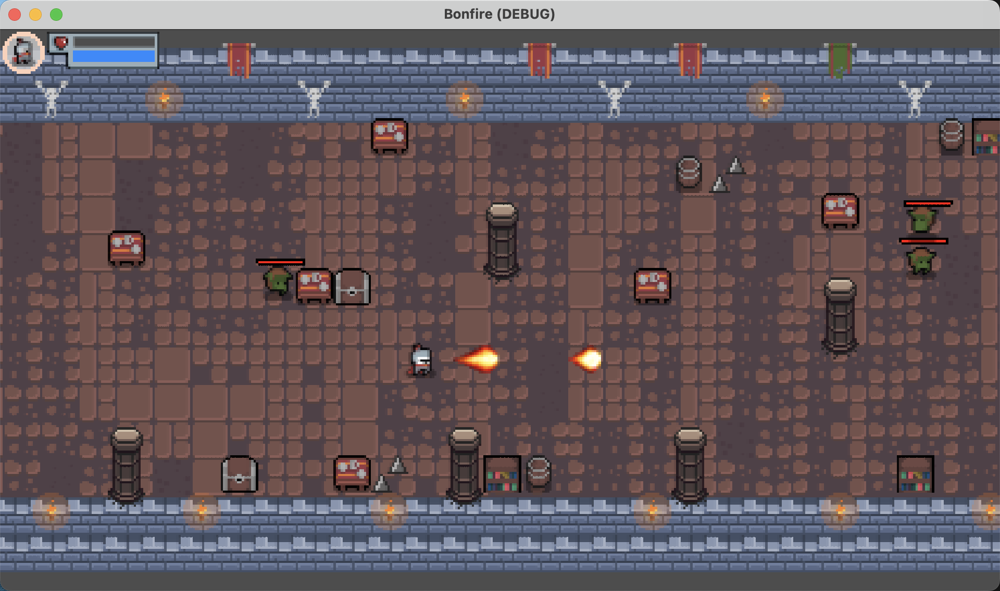

# Bonfire游戏

> Godot开发的游戏示例

## 游戏截图

## 游戏介绍

Bonfire是一个简单的游戏，玩家需要控制一个角色在游戏中移动，避开障碍物，并收集金币。游戏的目标是尽可能多地收集金币，同时避免与障碍物碰撞。

## 游戏玩法

1. 使用键盘上的方向键或WASD键来控制角色的移动。
2. 避开障碍物，尽量靠近金币。
3. 收集金币，增加得分。
4. 避免与障碍物碰撞，否则游戏结束。